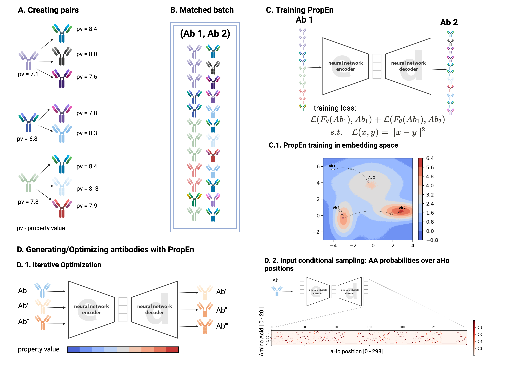

## Environment setup

Python 3.9.13

`pip install requirenments.txt`


## Running the code in parts

PropEn is a ResNet-based, auto-encoder model which requires matched data in a .csv format, containing two columns `s1, s2` with aho alinment representation. During training `s1` sequences are encoded and `s2` sequences are decoded. This directory contains all of the necessary to match, train and sample from a PropEn model.

1. Create matched data - use the script `match.py` to produce your `matched.csv` file
2. Train a model - `python train_matched.py --input_file matched.csv --model_name propen_hydrophobicity`
3. Sample new designs around seeds - `python train_matched.py --input_file seeds.csv --checkpoint propen_hydrophobicity_ckpt`


## All-in-one Propen (match, train, sample)

All you need is a csv file containing aho representation of heavy and light chains per sequence and a third column with property values you wish to optimize. See the example `data/input_test.csv` and the corresponding columns `seq_id,fv_heavy_aho,fv_light_aho,orcaa_hydrophobicity_negated`.
Running the following script will do the matching, training an sampling (from a training subset) in one go:

`python run_propen.py --input_file data/input_test.csv --property="orcaa_hydrophobicity_negated" --property_th=1 --same_epitope_threshold=5`

You can choose the listed as well as other parameter values based on the features and amount of data you have.
Once finished, you will find the new sampled sequences in the `results/` directory.


## Development set up

### Linting
Install pre-commit:
```
pip install pre-commit
pre-commit install
```

Or manually run ruff.


### Tests
Install pytest and run:
```
python -m pytest
```
